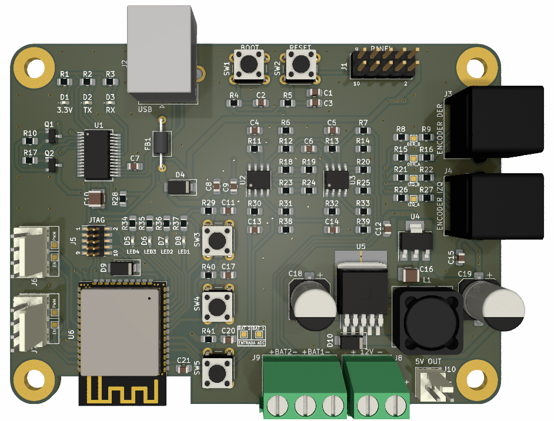

# DDRC-ESP32: Controlador para robot de tracción diferencial basado en ESP32

DDRC-ESP32 (Differential Driver Robot Controller con ESP32) es una placa de control embebido para robots de tracción diferencial. 
El controlador diferencial está basado en el módulo [ESP32-WROOM-32E](https://www.espressif.com/sites/default/files/documentation/esp32-wroom-32e_esp32-wroom-32ue_datasheet_en.pdf) de la marca [Espressif](https://www.espressif.com/), el cual cuenta con un SoC (System On Chip) modelo [ESP32-D0WD-V3](https://www.espressif.com/sites/default/files/documentation/esp32_datasheet_en.pdf).
La elección de este módulo se debe principalmente a que está soportado por [micro-ROS](https://micro.ros.org/docs/overview/hardware/). 

El controlador diferencial sirve de base para el desarrollo de robots de tracción diferencial cuyos algoritmos de navegación y control estén basados en [ROS 2](http://docs.ros.org/).

Las funciones principales del controlador diferencial son:
1. Leer la información de los codificadores ópticos acoplados a las ruedas de tracción.
1. Ajustar las velocidades de los motores de tracción mediante controladores PID.
1. Realizar el cálculo de la odometrı́a con la información de los codificadores ópticos acoplados a las ruedas.
1. Leer la tensión de la(s) batería(s) del robot.
1. Comunicarse con la PC a bordo del robot.

La siguiente imagen muestra un render del PCB del controlador diferencial.

  

## Videos

* [Proyecto Final: Controlador para robot de tracción diferencial compatible con ROS 2](https://www.youtube.com/watch?v=9FsznQ60jsQ&ab_channel=CIIIUTN-FRC)

## Documentación adicional

* [Ejemplo `blink` con ESP-IDF y Docker](doc/IDFBlinkDocker.md)
* [Nodo micro-ROS de ejemplo en ESP32 con Docker](doc/ESP32MicroROS.md).
